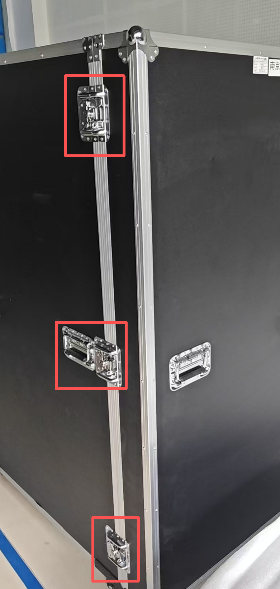
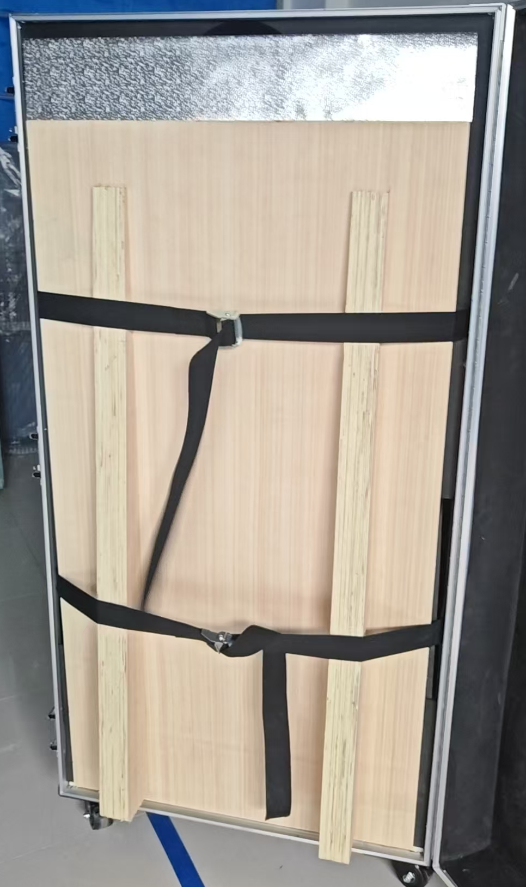
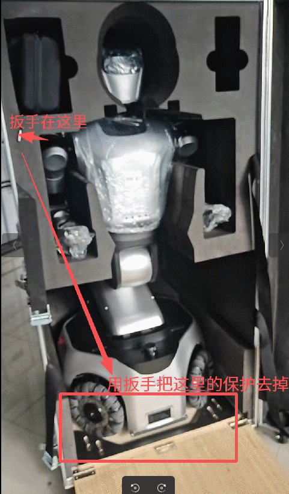

---

title: "Kuavo 5-W 开箱操作"

---

## Kuavo 5-W 开箱操作

### 1. 开箱

依次解锁3个锁扣，打开箱子。

### 2. 放置斜坡

拆开前下方的保护，放下木板，以便后续机器人的取出。

### 3. 拆除保护

使用自带工具将机器人底部固定螺丝拆下，如图所示：

### 4. 取出机器人

此时就可以两个人一左一右扶着机器人往外拉，把机器人拉出来。

