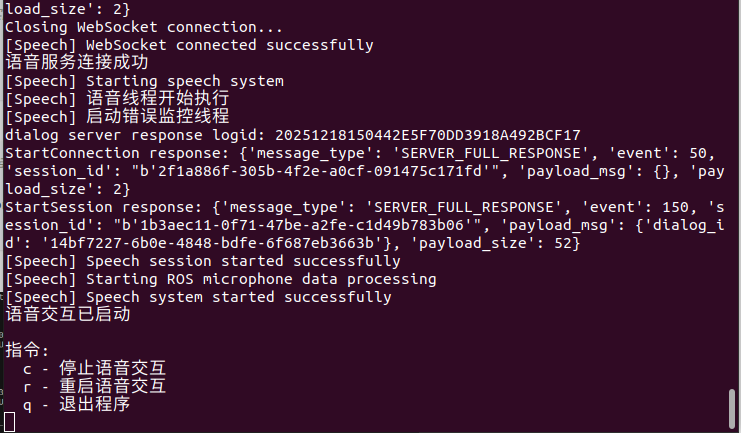

# 接入豆包实时语音大模型案例

## 描述

  - 接入豆包实时语音大模型，实现了一个基于 ROS 的语音交互系统，包括麦克风音频采集、实时语音交互和音频播放功能。
  
  - 示例代码路径:`<kuavo_ros_application>/src/kuavo_doubao_model/llm_doubao.py`

## 程序逻辑

1. 导入模块及定义全局变量

  - 作用：导入所需的 Python 标准库、第三方库和 ROS 相关模块，定义核心交互类。

2. ROSDialogSession 类

  - 作用：处理与豆包实时语音大模型的 WebSocket 通信，管理音频数据的接收、处理和 ROS 发布。

  - 关键逻辑：

    - 初始化会话 ID 和 WebSocket 客户端，建立与豆包大模型的连接

    - 通过单独线程处理音频块，实现音频数据的缓冲和处理

    - 将音频字节数据转换为 ROS 兼容的整数列表格式

    - 实现音频重采样（从 24kHz 到 16kHz）以适配 ROS 音频系统

    - 将处理后的音频数据发布到 ROS 话题

3. RobotLLMDoubaoCore 类

  - 作用：作为系统核心，管理麦克风音频采集、会话生命周期和整体交互流程。

  - 关键逻辑：

    - 初始化麦克风接口和 ROS 音频接口

    - 配置 WebSocket 连接参数，包括认证信息

    - 验证与豆包大模型服务的连接

    - 启动和停止语音交互系统

    - 在独立线程中运行异步会话，处理麦克风数据和服务器通信

4. 主程序代码路径:`<kuavo_ros_application>/src/kuavo_doubao_model/start_communication.py`

  - 作用：程序主入口，负责初始化 ROS 节点、建立豆包语音连接、启动语音交互和处理退出逻辑。

  - 关键逻辑：

    - 初始化 ROS 节点 voice_conversation

    - 创建 RobotSpeech 实例，用于管理语音交互

    - 调用 establish_doubao_speech_connection 方法，使用提供的 app_id 和 access_key 建立与豆包大模型的连接

    - 连接成功，调用 start_speech 方法启动语音交互

    - 进入循环，通过非阻塞方式检测键盘输入

    - 当检测到用户输入 'c' 或 ROS 节点关闭时，调用 stop_speech 方法停止语音交互

## 环境配置

### 上位机依赖安装

1. 运行一键部署脚本
```bash
cd <kuavo_ros_application>/src/ros_audio/kuavo_audio_player/scripts
chmod +x deploy_autostart_h12pro.sh
./deploy_autostart_h12pro.sh
```

2. 环境配置
- 安装相关依赖
```bash
# 安装音频相关系统库和USB音频支持
sudo apt install -y portaudio19-dev python3-pyaudio pulseaudio-module-udev
# 安装Python依赖（指定版本）
python3 -m pip install librosa==0.11.0
```
- 安装samplerate库
```bash
# 若您上位机的用户名为"kuavo" 则安装
python3 -m pip install samplerate==0.1.1
# 若您上位机的用户名为"leju_kuavo" 则安装
python3 -m pip install samplerate==0.2.1
```
- 安装torch库
```bash
# 运行检查本地是否已存在torch功能包
pip3 show torch
# 若显示无torch,则安装
python3 -m pip install torch==2.0.0
```
- 加载USB音频模块
```bash
sudo modprobe snd-usb-audio
```

## 说明

   ⚠️ **注意: 该案例使用了火山引擎的豆包端到端实时语音大模型，此模型为收费模型，需要自行创建账号充值获取APP ID和Access Token并将获取到的APP ID和Access Token复制到程序对应地方，使用时机器人上位机要连接外网（能访问互联网）**

   - 该案例所使用的豆包端到端实时语音大模型： https://console.volcengine.com/auth/login/

        - 登录后点击大模型-豆包实时语音模型-立即使用，获取APP ID和Access Token
        - 将程序`<kuavo_ros_application>/src/kuavo_doubao_model/start_communication.py`第11，12行的app_id，access_key替换成获取到的即可


## 执行

  - 执行本案例需要在上位机外接一个USB麦克风，最好是带有一键开关麦功能的麦克风。
  - 建议先在上位机系统设置中测试麦克风是否可用。
  - 启动
    ```bash
    cd kuavo_ros_application  # 进入上位机工作空间(根据实际部署目录切换)
    source devel/setup.bash
    roslaunch kuavo_audio_receiver receive_voice.launch  # 若终端提示未找到与关键词 ['USB Composite Device'] 匹配的设备，ctrl+c关闭程序，终端执行sudo modprobe snd-usb-audio 再重启程序
    ```
     - 另开终端输入`rosnode list | grep /audio_stream_player_node`查看`audio_stream_player_node`是否存在，存在则跳过运行`play_music.launch`。
     - 音响接下位机
    ```bash
    cd kuavo-ros-opensource  # 另开终端进入下位机工作空间(根据实际部署目录切换)
    sudo su
    source devel/setup.bash
    roslaunch kuavo_audio_player play_music.launch 
    ```
    - 音响接上位机
    ```bash
    cd kuavo_ros_application  # 进入上位机工作空间(根据实际部署目录切换)
    source /opt/ros/noetic/setup.bash
    source devel/setup.bash
    roslaunch kuavo_audio_player play_music.launch 
    ```
    - 运行案例
    ```bash
    cd kuavo_ros_application  # 另开终端进入上位机工作空间(根据实际部署目录切换)
    source devel/setup.bash
    python3 src/kuavo_doubao_model/start_communication.py 

  - 效果
    
