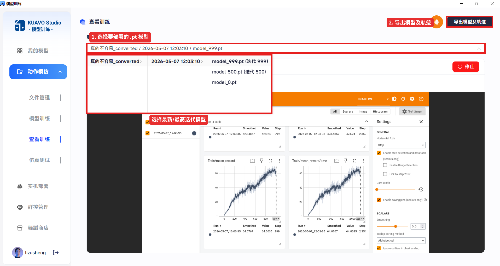
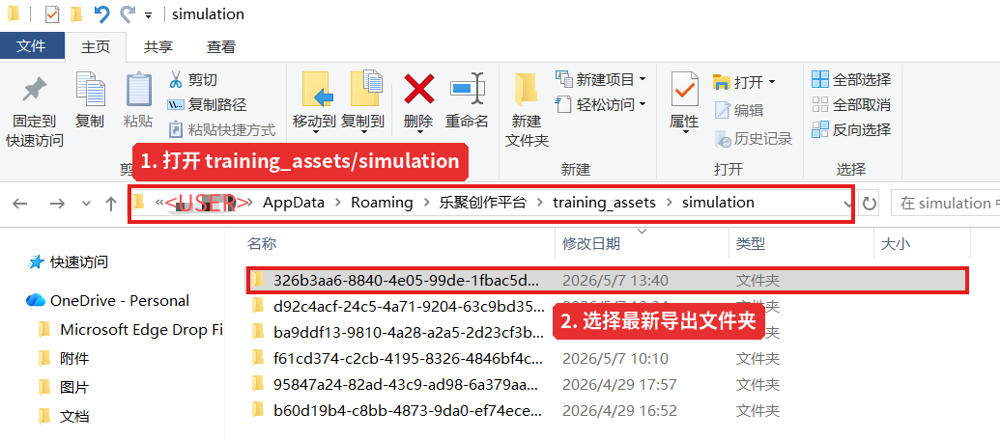

# Leju Creator 舞蹈导入说明

本文档说明如何使用 `import_creator_dance.py` 将 Leju Creator 导出的模型、轨迹和音乐部署到机器人仓库中。

## 1. 准备 zip 包

在 Leju Creator 页面中：

1. 选择需要部署的 `.pt` 模型。
2. 点击“导出模型和轨迹”。
3. 到指定导出目录下，找到最新生成的文件夹。

选择模型时，优先选择需要部署的训练目录和最高迭代 `.pt` 文件，然后点击右上角“导出模型及轨迹”。



导出完成后，在 `training_assets/simulation` 目录中按修改时间找到最新生成的文件夹。



Release 版默认导出目录：

```text
Windows:
C:\Users\<用户名>\AppData\Roaming\乐聚创作平台\training_assets\simulation\<模型ID>\

macOS:
~/Library/Application Support/乐聚创作平台/training_assets/simulation/<模型ID>
```

4. 将这个最新文件夹打成 `.zip` 包。
5. 将 `.zip` 包传到机器人上的本仓库中，例如：

```bash
tools/import_creator_dance/xxx.zip
```

zip 包内文件夹层级可以不同，支持 Windows 或 macOS 打包产生的路径结构。脚本会在 zip 内自动查找：

- `env.yaml`
- `model.onnx`
- `trajectory.csv`
- 可选的 `.wav` 音频文件

如果 zip 内有多个 `.wav`，脚本会按 zip 内路径字符串排序，使用排序后的第一个。

## 2. 音频格式要求

音乐文件必须是 WAV，推荐格式如下：

```text
格式: WAV
编码: PCM signed 16-bit little-endian
ffmpeg codec: pcm_s16le
采样率: 16000 Hz
声道: 1 channel, mono
采样位宽: 16-bit
比特率: 256 kbps
```

可使用 ffmpeg 转换：

```bash
ffmpeg -i input.mp3 -ac 1 -ar 16000 -c:a pcm_s16le output.wav
```

## 3. 使用方式

先设置机器人版本。脚本会根据 `ROBOT_VERSION` 写入对应控制器目录：

```bash
export ROBOT_VERSION=17
```

执行导入：

```bash
python3 tools/import_creator_dance/import_creator_dance.py \
  <zip_path> \
  <dance_name> \
  <customize_action_key> \
  [music_wav_path] \
  [--force]
```

示例：

```bash
python3 tools/import_creator_dance/import_creator_dance.py \
  tools/import_creator_dance/xxx.zip \
  dance_creator_demo \
  customize_action_M1M2_A \
  resources/music/dance_creator_demo.wav
```

如果不额外传 `music_wav_path`，脚本会优先使用 zip 内的第一个 `.wav`。如果 zip 内也没有 `.wav`，会将 JSON 中的 `music_name` 写为空：

```json
"music_name": [""]
```

## 4. 参数说明

- `zip_path`：Leju Creator 导出的 zip 包路径。
- `dance_name`：要注册的舞蹈控制器名称，只允许英文、数字、下划线，并且必须以英文字母开头，例如 `dance_creator_demo`。
- `customize_action_key`：要绑定的组合按键，必须来自 `customize_config.json` 已有 key。
- `music_wav_path`：可选，外部 wav 音频路径。传入后优先使用该音频，并复制到 `/home/lab/.config/lejuconfig/music`。
- `--force`：允许覆盖已存在的目标文件或已有按键绑定。

`customize_action_RT_B` 是保留按键，不允许修改，即使使用 `--force` 也会拒绝。

## 5. 常见问题

如果提示音乐已存在：

```text
music file already exists
```

说明 `/home/lab/.config/lejuconfig/music` 下已有同名 wav。确认需要覆盖时添加 `--force`。

如果提示关节数量不匹配：

```text
target ... has 27 joints, but creator export has 21
```

说明当前 `ROBOT_VERSION` 与导出的模型不匹配，需要切换到正确机器人版本，或重新导出匹配该版本的模型。

如果提示按键不允许：

```text
is not an allowed customize key
```

说明传入的按键不是 `customize_config.json` 中已有的组合键，或传入了保留按键 `customize_action_RT_B`。
